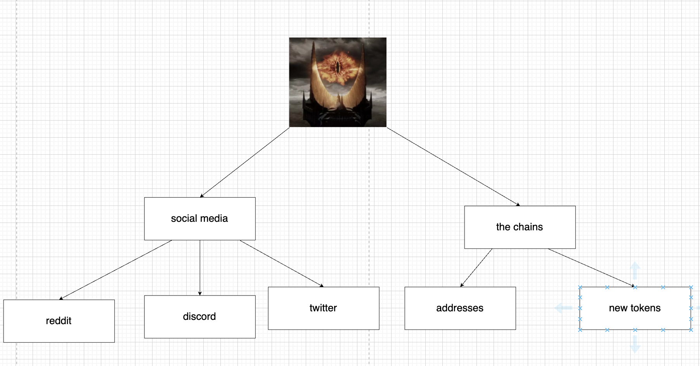
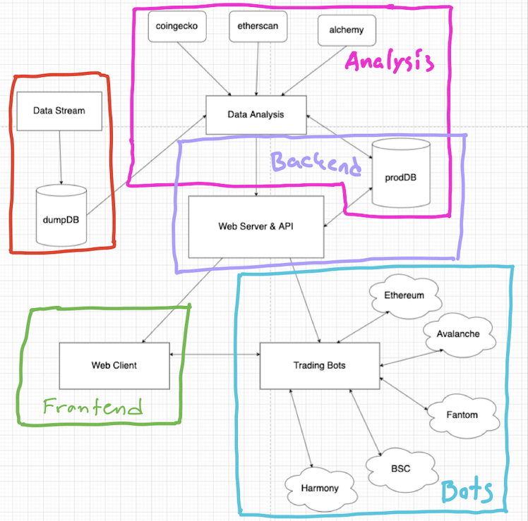

# Översikt

Några nice resurser:

-   https://ethereum.org/en/whitepaper/
-   https://ethereum.org/en/developers/docs/
-   https://github.com/ethereumbook/ethereumbook
-   https://danromero.org/crypto-reading/
-   https://a16z.com/crypto-startup-school/
-   https://a16z.com/2019/11/08/crypto-glossary/

defi

-   https://ethereum.org/en/defi/
-   https://academy.binance.com/en/articles/what-is-uniswap-and-how-does-it-work

solidity

-   cryptozombies.io
-   buildspace.io
-   https://docs.soliditylang.org/en/v0.8.11/

MEV

-   https://github.com/flashbots/pm

projektet är i princip uppdelat i 4 delar

-   /analys
-   /bots
-   /backend
-   /frontend

mål

arkitektur

### Analys

Flowet ska vara att en address kommer in, addressen analyseras, addressen sparas om den bedöms vara intressant. Utifrån analysen ger vi addressen labels. Exempel på saker som kan analyseras hos en address:

-   profitability
    -   totalt sedan kontot "skapades", men även under perioder. T.ex. kan det vara intressant att veta vilka konton som var lönsamma under senaste bear perioden.
    -   hur har addressen varit lönsam? erc20-tokens? NFTs? memecoins? är det en trader? är det en developer? Finns många alternativ, givetvis intressant att veta vad detta kontots "profil" är. T.ex. följer man en adress som har varit tidig till dogecoin, shib osv så kan det vara ett tecken på att man kaaaanske borde följa efter nästa gång adressen köper ett nytt dogcoin.
-   connections
    -   vilka andra adresser är denna adress kopplad till? vilka tokens är den kopplad till? vilka nfts? osv.
    -   vilka andra kedjor är denna address kopplad till? (Väldigt intressant). Alla EVM-compatible kedjor delar addresser, så om man ser att en ethereum whale "bridgear" till t.ex. avalanche kan det vara bra att följa dens rörelser.
-   portfolio
    -   vad har denna adress haft genom åren? vad håller den just nu?

### Bots

-   On-chain bots
    -   detta är bottarna som härjar på blockkedjorna, exempel på vad de gör/ska göra är
        -   lyssna på olika DEXes när nya par skapas
        -   analysera en token utifrån all information som är tillgänglig när den skapas
            -   till exempel så kan skaparen av denna token hittas, och om man ser att denna address är legit kan det vara värt att köpa medan om man ser att denna adress "skapades" för 10 minuter sedan så finns det en större risk att det är en scam.
        -   lyssna på olika addresser för att se vad de köper och säljer
        -   köpa och sälja automatiskt utifrån analysen ovan (kommer endast gå i vissa fall, men målet är att automatisera så mycket som möjligt)
            -   exempelscenario: Vi har en adress som enligt våra uträkningar har dessa stats (bland annat):
                active_since = 2017
                profit_usd = $100m
                current_account_value_usd = $10m
                Vi har också information om att denna adress har varit framgångsrik på över 5 olika kedjor (tyder på att det inte är någon val som endast köpte eth 2015 och är rik pga det). Våran bot får nu en notis om att denna adress har köpt en token med ett market cap på $10m och en simpel slutsats man kan dra är att detta med stor sannolikhet är något man bör copytradea. (inte ovanligt att tokens i denna storlek kan gå upp 10x på en vecka)
        -   generera ett feed för frontenden med allt som händer på blockkedjorna vi följer (ska vara i real-time)
            -   detta är bland annat hjälpsamt i de fallen där köpandet/säljandet ej går att automatisera och manuell analys måste göras. Till exempel i exempelscenariot ovan kan det vara nice att göra research (kolla twitter, deras hemsida etc) innan man köper. (såklart hade det varit nice om man lyckas automatisera även detta)
-   MEV-bots
    -   "Miner extractable value" är ett visst värde för varje transaktion (ibland 0), och detta värde är tillgängligt för den som letar. Som "mev-searcher" kan man antingen leta arbitrages, liquidations och göra sandwich attacks. Nackdelarna med dessa bottar är att jag tror att de är väldigt svårt att få dem till den nivå då man kan tävla med de bästa och faktiskt få ta del av MEV, men fördelen blir att man kan hitta trades där man är garanterad en vinst OCH att detta funkar oavsett hur marknaden går i allmänhet. Bitcoin och ethereum går ner 50%? Spelar ingen roll då det fortfarande kommer att finnas MEV. Inte researchat tillräckligt mycket om detta än, men min uppfattning är att man måste vara rätt bra på solidity för att kunna ta MEV på ett effektivt sätt. Jävligt intressant dock och kan vara en bra utmaning. Dessa lever också onchain givetvis och om man lyckas skriva effektiva bottar här tror jag man kan ha stor edge vid vanlig "altcoin" trading också.
-   Off-chain bots
    -   bots som tradear på exchanges (coinbase, binance, kraken, ftx etc).
    -   ytterst tveksamt om detta ens är värt det, barrier to entry är låg (enkelt att göra dessa bottar) och det finns bara större tokens tillgängliga. Skulle tro att edgen man kan få här jämfört med on-chain bottar inte ens är en tiondel.
-   information bots
    -   bots som har syftet att bara leta internet för information gällande tokens.
    -   twitter
        -   exempeltillämpning:
            väljer alla vettiga konton från twitter samt alla dom följer. Kolla alla deras tweets (ex från jan 2021 till nu), spara alla tokens som har nämnts i tweets samt hur många gånger de har nämnts. Vi har nu en hashmap med alla tokens som någonsin har nämnts av dessa konton (som enligt bedömningen är vettiga) och kan nu lyssna på twitter efter tokens som dessa konton aldrig har nämnt (om ingen av dessa konton har nämnt en token så är man med nästan all sannolikhet tidig). Lyssnandet bör göras inte bara på denna grupp av vettiga konton och dom som dom följer, utan även på de som följer dessa vettiga konton. (jättemycket shitcoins kommer dyka upp ja, men även vettiga saker och om man kan frontrunna twitter är det något man bör göra)
    -   discord
        -   exempeltillämpning:
            bots som är kryptorelaterade discords och som dels kan göra liknande saker som i twitterexemplet, men även till exempel analysera i vilka kanaler som det är mesta aktivitet i. Till exempel, om en discord har 10 kanaler för olika blockkedjor och vi ser att en stor del av diskussionen rör sig till en någorlunda ny kedja så kan slutsatsen dras att folk är intresserade av denna kedja och då är det nog fördelaktigt att sätta upp bottar som lyssnar på denna nya kedja.
    *   och massor mer

### backend

I princip en REST API bara, som exponerar databasens innehåll. Bottarna och klienten kommer att använda sig av denna API. Denna databas är alltså den där allting från analysen hamnar. Just nu en postgressql databas och en API i python med fastAPI. Inte så mycket som kommer in i databasen här ifrån, om ens något. Kanske hjälpsamt att kunna göra saker manuellt från klienten, t.ex. lägga in en ny address man vill följa.

### frontend

Först och främst en dashboard/trading view som visar vad som försiggår i databasen, men även som visar vad som försiggår on-chain rent generellt också. Så att denna dashboard ska visa allt som finns i databasen är givet, men den ska även annan information som går att få via olika api-tjänster t.ex.

-   defillama.com för stats om defi i allmänhet
-   dexscreener.com som har charts för mindre tokens
-   etherscan.com, bscscan.com, ftmscan.com osv. för information om det mesta

Målet är denna app ska kunna ge så mycket information som möjligt på så liten yta som möjligt. Inte UI/UX för nybörjare, det ska vara en rätt avancerad "trading view". Saker man ska kunna göra i real-time (med websockets) är bland annat:

-   se vad addresser man följer gör
-   se nya tokens
-   se vad bottarna gör

Är en react app med nextjs.org
